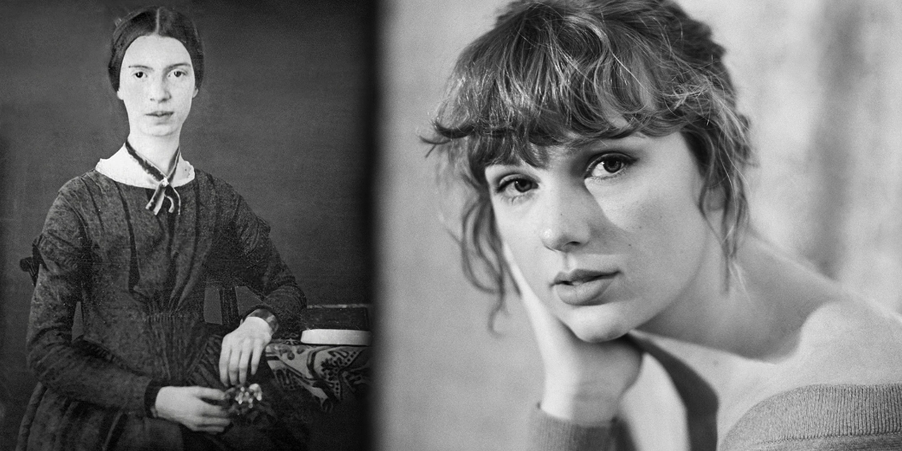

# Lyrical Analysis and Comparison of Taylor Swift's _folklore_ and _evermore_ to poet Emily Dickinson

## Background Information
For my Digital Humanities 101 individual project, I will compare singer-songwriter Taylor Swift’s eighth and ninth studio albums, folklore and evermore respectively, to Emily Dickinson’s poetry. Swift’s albums folklore and evermore, both released in 2020, received critical acclaim and praise for their poetic lyricism and themes of nostalgia and escapism. Written and produced during quarantine, Swift strayed from her usual autobiographical writing style found in her previous work and created a world of fictional narratives like the likes and legacies of folk songs and poets, like Dickinson. Dickinson has been regarded as one of the most notable and important figures in American poetry. She lived most of her life in isolation, surrounded by and kept company by the works and writings of other authors and metaphysical poets. Dickinson’s poetry, crafted in solitude, mirrors the conditions in which folklore and evermore were created as well. 

Given the scope of this project and my own abilities and limitations, I have centered my research question to be: What are the lyrical similarities and differences between Swift and Dickinson’s poetry? Through answering this question, I hope to also uncover: Are there any overlapping words or phrases employed by both poets across their work? I also wonder if their composition under situations of isolation have influenced their work in similar or differing ways. Swift’s poetry has been compared to poets of the past before, most notably to the “Lake poets,” a group of English poets from England (William Wordsworth, Samuel Taylor Coleridge, and Robert Southey), to which she references in folklore (deluxe version)’s 17th track, the lakes (“Take me to the Lakes / where all the poets / went to die”). Her lyricism has also been compared to metaphysical poet John Donne. I’ve chosen to delve into potential lyrical parallels between Swift and female poet Dickinson since most comparisons to the singer-songwriter are with male writers. Throughout my research, I discovered that Dickinson is Swift’s sixth cousin five times removed, which adds another layer of interest to my own comparison of their work. 

As a fan of both writers, I have chosen to focus my individual project on a lyrical analysis of both poets. For this project, I will use all 17 tracks’ lyrics from folklore (deluxe version) and evermore (deluxe version) courtesy of Genius and “Poems by Emily Dickinson, Three Series, Complete” courtesy of Project Gutenberg. I will convert the song lyrics into .txt files and import the plain text version of Dickinson’s poetry collection into a Jupyter Notebook and analyze word frequencies from all three sources to create word clouds related to word frequency. To ensure my analysis of the texts is true to the source, I will be removing punctuation and stop words in “Poems by Emily Dickinson, Three Series, Complete” to avoid including filler and/or common words in my word cloud.

## Takeaways

Throughout this research process, I expected to find overlapping similarities in lyrics between Swift’s albums and Dickinson’s poetry. In Swift’s album evermore, the song "ivy" tells the story of a married/taken woman having an affair, featuring whimsical and escapist lyrics such as “my pain fits in the / palm of your freezing / hand / taking mine, but it’s / been promised to / another” and “clover blooms in the / fields / Spring breaks loose, / the time is near / What would he do if / he found us out?” The narrative told by Swift parallels the (alleged) relationship between Emily Dickinson and her childhood friend Sue Gilbert, who later became her sister-in-law after marrying Dickinson’s brother, Austin Dickinson. The two lived next door to each other and wrote “electric” love letters to one another. Swift even approved for her song to appear in the ninth episode of Apple TV’s comedy-drama series season three of “Dickinson” after a love scene between the characters based on Emily and Sue. The apparent real-world connections between Swift and Dickinson, therefore, have led me down the rabbit hole of discovering more parallels between the two writers.

Amongst the three texts, the selected trio of texts had the running theme of time and memory interwoven amidst them. In Swift's two albums, the top 5 most frequent words were "never," "time," "knew," "would," "gave," and "could," "never," "youre," "think," and "love," respectively. Their respective word clouds also reveal similarities in tone and topics, which fall under the theme of time and reflection. Despite encountering errors with Dickinson's word cloud, taking a look at the POS tagging step, the top words there also align with the themes of time and reflection:

Swift's relation to time in both albums is accompanied by words associated with nostalgia and memories of what was lost and what could have been, similarly, Dickinson does as well ("would", "could", and "never" frequently populate her prose).

It is interesting to note that both prose writers composed these selected texts in isolation from others. Swift's albums were composed in 2020, during the beginning of the COVID-19 pandemic and quarantine, whereas Dickinson, who was alleged to experience social anxiety, chose to be secluded away from others. It is safe to say that under these conditions, both artists had much time to reflect on the concept of time.

## Limitations
Some things I would have done differently given more time and experience with coding would be additional manipulations to the text. My biggest roadblock with this project was getting the Dickinson word cloud to accurately display the most frequent words. Folklore’s and evermore’s word clouds had no issues, however, Dickinson’s word cloud appears nearly empty in comparison despite following the same tokenization process. After consulting with online resources such as ChatGPT, I believe the issue stems from the length of the text. While folklore and evermore had around 800 rows of words after being “cleaned,” Dickinson’s poetry collection had over 4000 rows of words. Because of this, there might have been memory limitations and tokenization issues. With more time, I would have attempted batch processing or selected one volume of poetry rather than the entire collection with the three volumes.

In addition to troubleshooting code, with more time I would have liked to expand on the topic of isolation between the prose of both artists.
